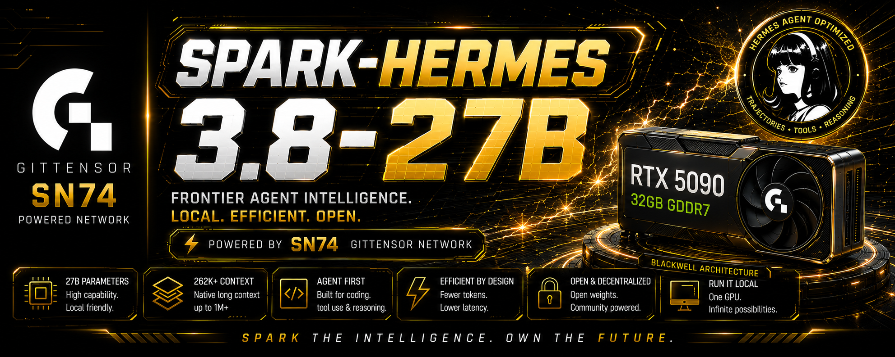

<sub>The RTX 5090 in the artwork is the **distribution** target, not the training host: training
and scoring happen in bf16 on an RTX PRO 6000 Blackwell Server Edition (96 GB), and what ships is a
GGUF quantization that fits a 32 GB card. See [Two tiers](#two-tiers-bf16-to-train-gguf-to-ship).
One thing in the artwork is still wrong: "lower latency" is not something a miner is scored on —
wall time is reported and never gates the crown, for the reason given under
[Pareto frontier](#pareto-frontier).</sub>

# SPARK-HERMES

### Verified agent intelligence, continuously improved by SN74 Gittensor

**Target:** `Spark-Hermes-3.8-27B`
**Development baseline:** pinned `Qwen3.6-27B` @ `6a9e13bd`, served bf16
**Train and score on:** RTX PRO 6000 Blackwell Server Edition, 96 GB, bf16
**Ship as:** GGUF, sized for a 32 GB card
**Runtime:** Hermes 4
**Competition:** verified rollout optimization
**Execution:** NVIDIA Confidential Computing enabled; Intel TDX quote verification implemented,
no approved guest measurement pinned yet

> **Same model. Better rollout. Verified improvement. Better next model.**

Spark-Hermes is an open-weight Hermes-native agent model improved through continuous,
verifiable competition.

```text
RUN → OPTIMIZE → VERIFY → LEARN → REPEAT
```

The current model attempts real tasks. When it fails, loops, uses excessive tokens or tool
calls, or takes too long, that execution becomes a challenge.

SN74 miners compete to make **the same frozen model** perform the task better. Accepted
improvements are hardware-attested, independently verified, added to the training corpus,
and used by the maintainer to train the next open Spark-Hermes checkpoint.

---

## The continuous improvement loop

```text
TASK
  │
  ▼
FROZEN SPARK-HERMES MODEL                 the validator runs the baseline
  │
  ├── verified + efficient ────────────────┐
  │                                        │
  └── fail / loop / expensive              │
             │                             │
             ▼                             │
       CHALLENGE PACKET                    │  datasets/challenges/
             │                             │
             ▼                             │
       SN74 MINERS                         │  improve a private surface
             │                             │  SOUL.md, skills, references
             ▼                             │
   PRIVATE BUNDLE ──► validator API        │  the surface stays the miner's edge
   PUBLIC DIGEST  ──► pull request         │  timestamped, attributable, binding
             │                             │
             ▼                             │
     VALIDATOR RUNS IT                     │  pinned model, environment, runtime
   pinned everything, its own hardware     │  withheld verifiers never leave
             │                             │
             ▼                             │
       VERIFY + SCORE                      │  correctness gates efficiency
             │                             │
             ▼                             │
     ONE CROWN PER HOUR                    │  every other pull request closes
             │                             │
             ├──► ROUND PROOF PUBLISHED    │  the commitment is opened
             │                             │
             ▼                             │
  VERIFIED SFT / PREFERENCE DATA           │
             │                             │
             ▼                             │
    TRAIN NEXT SPARK-HERMES                │
             │                             │
             └─────────────────────────────┘
                         REPEAT
```

This is the product: not a one-time fine-tune, and not a miner race to use the biggest
hidden model.

---

## How a submission works

A miner uploads their surface bundle **privately** to the validator API and opens a pull
request carrying **only its digest**.

```text
POST /v1/round/{id}/submission     {miner_id, files: {path: content}}
   ↓
receipt: submission_id, bundle_sha256, status=pending
   ↓
pull request appends one line naming that digest
   ↓
validator runs the bundle the digest identifies
```

Both halves are load-bearing and neither works alone. A private upload with no public
commitment is unauditable: nothing outside the validator records what was submitted, by whom,
or when. A public surface is no longer an edge: the miner's strategy is the thing they are
competing with, and publishing it hands it to every competitor.

Together they give the property that matters. The validator cannot evaluate a bundle other
than the one committed, and the miner cannot revise after the fact — the digest was published
before anything ran.

The digest **selects** which bundle is evaluated. A miner who uploads twice and commits to the
first is evaluated on the first, not on whatever arrived most recently. That is what makes the
public commitment authoritative rather than decorative.

The upload is a JSON map of path to text, not an archive. A tarball brings path traversal,
symlinks that resolve outside the extraction root, and decompression bombs; a map of strings
has none of them, and a surface is a few kilobytes of prose so the encoding cost is nothing.
Everything is validated — size, path shape, then the contract in
[`hermes/miner_contract.json`](hermes/miner_contract.json) — before a byte reaches the
filesystem.

A receipt carries envelope facts only: `submission_id`, round, miner, digest, time, file count,
bytes, and status. Nothing about merit. The endpoint is cheap to call repeatedly, so anything it
said about correctness would be a free oracle on the withheld check.

```text
pending → evaluating → result
```

`GET /v1/submissions` serves those receipts, and `GET /` is the board that renders them — served by
the validator that issued them, so the page reads this host's own endpoints and there is no second
place to configure a URL. One row per submission in arrival order, and no other ordering: the
receipts deliberately carry nothing that could support a ranking.

An unreachable validator and a round nobody has submitted to both produce an empty table, and only
one of them means the board is lying. They render as different messages.

---

## Why the validator runs the surface

At this stage the validator executes the submitted bundle itself: pinned model, pinned
environment, pinned runtime, on its own hardware, against verifiers the miner never holds.

That removes an entire class of question rather than answering it. Under miner-side generation
the attestation proves genuine confidential hardware and binds to the exported files — but no
approved guest measurement is pinned, so a quote proves *a* confidential VM ran, not that it ran
an image anyone approved. On hardware the submitter owns, that is the whole question. Running it
here means the model, the environment and the checks are not claims at all.

The cost is that a miner must now trust the validator, which is what the round proof below is
for.

---

## What miners compete on

For each challenge, the model and execution environment are fixed.

### Fixed by the epoch

What the code pins is [`PINNED_CONFIG_KEYS`](hermes/profile.py):

```text
model                     terminal.timeout
provider                  toolsets
agent.reasoning_effort    tool_output
terminal.backend          compression
                          context.engine
```

alongside the model digest, the tokenizer, the Hermes commit, the system prompt and tool
schemas, the initial workspace, the verification contract, the budgets and the replay seeds.

### Miner-controlled engineering space

```text
system / SOUL prompt      recovery policy
skill selection           verification policy
planning policy           stopping policy
context management        tool-use policy
```

Miners do **not** win by changing model weights. They win by making the same model behave
better.

**Sampling is not pinned, and was described in two contradictory ways.** This list used to end
with "sampling policy" as miner-controlled while the section below claimed the epoch fixes
"generation settings". Both cannot hold, and neither matches the code: the pinned list fixes
`agent.reasoning_effort` and says nothing about temperature or top-p. Read it as unpinned — a
pin that is only described is not a pin, and a miner tuning temperature today is inside the
rules as written.

---

## One canonical model epoch

Every miner runs the same content-addressed deployment artifact for a model epoch.

```text
open base / Spark-Hermes checkpoint
        ↓
canonical inference runtime
        ↓
model epoch digest
        ↓
same bytes on every miner
```

"Same model" means identical weights, tokenizer, runtime configuration and Hermes protocol —
not merely the same model name.

**Nothing in that chain is quantized.** [`hermes/base_model.json`](hermes/base_model.json) pins
`Qwen/Qwen3.6-27B` at revision `6a9e13bd` with no quantization field, and the measured baseline
served it in bf16 — which is why the KV figure in that file is `kv_bytes_measured` rather than one
computed from an assumed precision. The competition is decided on those bytes.

<a id="two-tiers-bf16-to-train-gguf-to-ship"></a>

### Two tiers: bf16 to train, GGUF to ship

Quantization is a **distribution** step that happens after the competition, not a step inside it:

| | train and score | distribute |
|---|---|---|
| precision | bf16 | GGUF |
| card | RTX PRO 6000 Blackwell, 96 GB | 32 GB class, e.g. RTX 5090 |
| why | 30 B parameters at two bytes each is ~60 GB of weights before optimizer state, adapters or KV — it does not fit 32 GB, and a 4-bit *training* base fits adapters to a model nobody serves | four-ish bits a parameter puts the same 30 B model inside 32 GB with room for context |
| who runs it | validators, and miners reproducing a round | whoever wants to run the thing |

The reason to keep them apart is that a score does not survive the crossing.

**A number measured at bf16 is not a claim about the GGUF build.** `hermes.promotion` refuses to
compare two runs whose `Serving.precision` differs, and refuses harder when either leaves it
blank — so the quantized build's success rate, token cost and protocol conformance have to be
**re-measured**, never inherited. Quantization changes logits; whether it changes *outcomes* on
agentic tasks is an empirical question about that specific quantization, and answering it is one
run of the same suite. Publishing a bf16 score beside a GGUF download without saying which was
measured is the one thing this split exists to stop.

So the honest sequence is: compete and promote in bf16, then quantize, then re-run the suite on the
quantized artifact and publish that number too — with `Serving.precision` recorded on both, which
is what makes the pair comparable at all.

---

## The round proof, and where confidential computing becomes load-bearing

The validator runs the surface, so a miner takes its word for the result unless something makes
that word checkable. After a round settles it publishes a bundle:

```text
challenge.json     the challenge it ran, with the withheld-check commitment
round.json         the ledger, verdicts included once graded
reveal.json        the per-task salt, released at settle
episodes/          the logs each verdict came from
scorecards/        the decisions
manifest.json      a digest of every file, and claim_sha256 over all of them
```

`python -m validator.audit verify` recomputes `salted_digest(withheld_check, per_task_salt)` and
compares it to the commitment the challenge published **before submissions opened**. That is the
claim it supports: the validator graded against the check it committed to, not one written
afterwards to suit a result. The salt is per-task —
`derive_task_salt` is `HMAC(master, task_id)` — so opening one round leaves every unspent task's
commitment sealed. The master never enters a bundle, and `build` searches for it rather than
trusting itself not to have written it.

### What the bundle does not prove, and what would

That the episodes came from the pinned model. Nothing in a published bundle can: a validator
willing to fabricate a log can fabricate a consistent one. The manifest says so in a
`does_not_prove` field rather than letting a reader infer more from the word "manifest".

That is where confidential computing earns its place. Run the evaluation inside a measured VM and
bind `claim_sha256` as the NRAS nonce and the TDX REPORTDATA — the same binding
[`proof/bundle.py`](proof/bundle.py) already uses — and the log is tied to hardware running an
approved image.

The pieces are real and verified end to end on an RTX PRO 6000 Blackwell with CC enabled: NRAS
issues a signed token (`measres: success`, `secboot: true`, nonce echoed), and
[`eval/attestation.py`](eval/attestation.py) accepts it while refusing a self-signed local one.

One gap stands between that and the stronger claim. `check_tdx_measurement` is called with no
allowlist, so it returns `None` — no approved guest measurement is pinned. Until one is, a quote
proves a genuine confidential VM ran and committed to this bundle, not that it ran an image we
approved. The gate also tests `if measured is False`, which cannot fire on `None`: today that is
a check incapable of failing, and pinning a measurement means fixing both.

---

## How a task becomes a challenge

The canonical model first runs the task with the canonical strategy.

A challenge is created when the baseline:

```text
fails verification
times out
enters a no-progress loop
uses excessive tokens
uses excessive model turns
uses excessive tool calls
repeats expensive actions
finishes without enough verification
or succeeds far above the expected resource envelope
```

Example:

```text
BASELINE
result      FAIL
tokens      57,000
tool calls  38
wall time   300 s

MINER CANDIDATE
result      PASS
tokens      22,000
tool calls  11
wall time   74 s
```

Failure → verified success is the highest-value improvement.

---

## Endless task generation

The validator does not hand-write an infinite benchmark. Task supply comes from:

```text
real user / agent workloads
public repositories at pinned commits
issues and regression cases
existing agent benchmarks
generated tool-use scenarios
mutation-generated repository failures
failure clusters from the current Spark-Hermes model
```

### Mutation supply

```text
known-good repository
      ↓
controlled mutation
      ↓
confirm the original verifier now fails
      ↓
new repair task
```

Mutation families can vary logic, boundary conditions, configuration, dependency state,
multi-file consistency, error handling, tool availability, generated artifacts and
performance constraints.

Equivalent mutations are discarded.

### Difficulty mining

Generated tasks are classified against the current baseline:

```text
too easy   → coverage / SFT
frontier   → miner competition / preference signal
very hard  → failure discovery / future curriculum
```

As Spark-Hermes improves, the challenge generator must continuously find harder failures.

---

## A withheld check prevents hard-coding

**Hidden sibling tasks do not exist.** This section described each visible challenge as the
head of a family of hidden variants — A, B, C — varying repositories, filenames, constants and
error order. No task in the corpus declares a sibling or a family; grep for either and the only
hit is a line in [`hermes/miner_contract.json`](hermes/miner_contract.json) citing "the
hidden-sibling defence" as though it were already in place. The mechanism further down this
file has always listed sibling verification as a *planned* boundary, and this section
contradicted it.

What exists, on all 19 tasks, is a **withheld check on the same task**:

```text
visible task
├── published verifier      the miner can read it, so it can be optimised against
└── withheld verifier       committed by salted digest, held privately
```

Both run on every attempt. A strategy that passes the published check and fails the withheld
one is counted in `overfit_rate` — it learned the benchmark rather than the job. That is a
narrower defence than a task family: it catches a strategy fitted to the *published assertions*,
and it does not catch one fitted to this repository's filenames and constants. Sibling tasks
would catch that, which is why they are still on the roadmap.

Each task's salt is derived per task, `HMAC(master, task_id)`, so publishing one task's salt
after its round settles says nothing about any other. Under a single shared salt the first
audit would unseal every unspent task in the corpus.

---

## How miner work is scored

### Correctness is a gate

No efficiency reward exists until all required gates pass:

```text
correct model epoch
valid Intel TDX + NVIDIA CC evidence
valid Hermes protocol
allowed tools only
complete trace
public verifier pass
hidden verifier pass
security checks pass
minimum verification strength
budget respected
```

### Two kinds of win

**1. Failure → success**

```text
baseline:  fail
candidate: pass
```

**2. Expensive success → efficient success**

Both pass, but the candidate improves:

```text
model turns ↓            the axis a strategy actually moves
input tokens ↓           follows from turns; see below
weighted tool cost ↓
repeated actions ↓
output tokens ↓          5.1% of the bill
```

while maintaining equal or stronger verification.

**Input and output tokens are not two comparable axes.** Measured over the 190-episode baseline:

```text
input   9,271,813   94.9%      re-sent context
output    493,190    5.1%
cache hit rate          0.00%  prefix caching was off for that run
```

Input dominates by nearly twenty to one, and almost all of it is the same conversation re-sent
on every turn.

Prefix caching has since been turned on for the pinned model and measured at an **80.8%** hit
rate, so the system prompt and the accumulated conversation are served from cache after the first
turn. That changes what the number means without changing the ranking: input is still the bill,
but most of it is no longer paid twice. The tighter constraint is the 32,768-token window, which
caching does nothing for -- the model still re-reads every earlier turn before each decision. So a strategy does not reduce input tokens by
writing less — it reduces them by taking fewer turns, and input follows. Listing the two side
by side invites a miner to optimise the 5% and read the 95% as separately winnable. Wall time
is deliberately absent from this list; the section below says why.

### Verification cannot regress

The cheapest possible rollout is to stop checking. That is not optimization.

Fewer tests or verification calls count only when the task's required verification remains
fully satisfied.

---

## Pareto frontier

There is no universal exchange rate between one token, one tool call and one second.

After correctness gates, candidates are compared as a vector:

```text
gates the crown          verified success
                         overfit rate (published pass, withheld fail)
                         tokens
                         model turns
                         weighted tool use
                         repeated actions

reported, never gates    wall time
```

Non-dominated candidates remain on the challenge's Pareto frontier. A pre-registered SN74
reward policy distributes emissions across that verified frontier.

### Wall time is reported and never gates the crown

This section claimed wall time was a frontier axis, normalized as
`normalized_time = candidate_time / baseline_time`, "so hardware variance does not masquerade as
strategy quality". [`hermes.acceptance.dominates`](hermes/acceptance.py) does the opposite, and
deliberately:

> Tokens and tool calls are exact and recomputable from the trace. Wall time is not, and a
> king-of-the-hill bar that only ever rises would lock in whichever run got favourable
> scheduling — permanently, because no later run could legitimately beat it.

Dividing by a baseline on the same node removes the node's *average* speed. It does not remove
run-to-run variance, and the crown is a ratchet: once a lucky measurement sets the bar, no
honest strategy can clear it and the bar never decays. A ratio does not fix a metric that is not
recomputable from the trace, so latency is reported beside the crown and gates nothing.

---

## What accepted rollouts train

The successful candidate is especially valuable because it comes from the same model that
originally failed.

### SFT

Verified trajectories teach:

```text
observe → plan → act → read result → recover → verify → stop
```

### Preference data

Matched states can create strong preferences:

```text
state:
  patch exists
  tests have not run

chosen:
  run targeted test

rejected:
  claim completion
```

Policy-only ties are not quality preferences.

### Critic / recovery data

Failed baselines teach:

```text
loop detection
premature completion
bad tool choice
failed recovery
redundant context
weak verification
```

### Later RL

Repeated rollouts from the same student policy can later support verifier-reward RL / GRPO.

---

## The SN74 learning flywheel

```text
M0 = current model
H0 = current strategy

miners improve:
(M0, H0) → (M0, H1)

verified rollouts become:
D1

maintainer trains:
(M0, H1, D1) → M1

M1 becomes the next frozen model
        ↓
new failure frontier
        ↓
new miner competition
        ↓
new verified dataset
        ↓
M2
        ↓
repeat
```

> **Miners improve behavior. Verified behavior becomes data. Data improves the weights.
> Better weights create a harder frontier for miners.**

---

## Why trajectories, not chat

Chat teaches an answer:

```text
User: How do I fix this bug?
Assistant: Check memory allocation.
```

A real rollout teaches behavior:

```text
inspect repository
→ run failing test
→ inspect evidence
→ patch
→ run targeted test
→ run full verifier
→ stop
```

[`hermes/trajectory.py`](hermes/trajectory.py) represents executed action/observation traces.
A tool call with no observed result is not a real tool-use trajectory.

### A trajectory is only half a row

The other half is the prompt that caused it. Assistant turns are a response to specific
text, so a row that does not record which prompt it ran under cannot honestly be trained
on, and one exported under a *different* prompt teaches instructed behaviour as though it
were spontaneous. Executed rows carry their prompt, and the exporter refuses one that does
not.

That makes the question answerable rather than assumable: the model is served under some
prompt, and if it is not the one that produced the data, the difference has a price.
[`hermes/leakage.py`](hermes/leakage.py) measures it — on the current mining export, 83 of
133 rows carry assistant text whose only source is the system prompt.
`hermes.format --system-policy` is where that is decided. Measure first: once the prompt is
gone there is nothing left to trace the text back to, and the rate reads zero because it is
unmeasurable, not because the corpus is clean.

---

## The stack

| Component | Role |
|---|---|
| **Spark-Hermes** (this repo) | challenge generation, rollout competition, corpus construction and training |
| [**SparkProof**](https://github.com/gittensor-model-hub/SparkProof) | verified Triton training corpus, and its export/dedupe primitives |
| [**SparkInfer**](https://github.com/gittensor-ai-lab/sparkinfer) | canonical fast inference for the frozen model |
| **Hermes Agent** | agent runtime, tools, sessions and execution semantics |
| **SN74 Gittensor** | open competition and rewards for verified marginal improvement |

---

## Model path

### Development

```text
Qwen3.6-27B
    ↓
Hermes 4 baseline
    ↓
verified rollout-evolution corpus
    ↓
Spark-Hermes development checkpoint
```

### Target

```text
open Qwen3.8-27B base when available and pinned
    ↓
same verified pipeline
    ↓
Spark-Hermes-3.8-27B
```

The exact revision and artifact digest—not the marketing name—define a model epoch.

The development baseline is pinned in [`hermes/base_model.json`](hermes/base_model.json):
`Qwen/Qwen3.6-27B` at `6a9e13bd6fc8f0983b9b99948120bc37f49c13e9`. A name resolves to
whatever a repository holds when someone runs it, so two runs could agree on every other
digest here and still have trained on different weights.

Two things about that baseline are easy to get wrong and are recorded with the pin. It is a
`Qwen3_5ForConditionalGeneration` with a vision tower, so "27B" is not 27B of text
parameters and the text hyperparameters live under `text_config`. And its own chat template
emits `<tool_call>`, `<tools>`, `<tool_response>` and `<think>` and does not emit
`<scratch_pad>` — which is how the Hermes 4 dialect was established here: by reading the
model, not by choosing for it. Nothing forks Hermes; [`hermes/templates/`](hermes/templates)
pins the rendered wire format as bytes so a change to it has to appear as a diff.

Qwen3.8-27B is announced and **not yet published**.

---

## Current status

The loop runs end to end. Most of it has been driven on the pinned model against a real challenge
packet rather than only in tests, and the two columns say which is which — a status section that
does not distinguish "exercised" from "implemented" is how a repository comes to claim more than it
has.

```text
                            exercised on the live model?
announce a round            yes    commit-reveal seed, rendezvous assignment
open a window over a packet yes    persisted; the API serves it
miner checks a surface      yes    contract + the runtime's own assemble, no GPU
miner rehearses             yes    paired arms, the real acceptance gate
miner uploads a bundle      HTTP   validated before storage; over the real app, not the box
validator runs it           yes    --miner-dir, pinned everything
score                       yes    against the published bar, withheld check counted
record                      yes    submit → freeze → verdict → grade → settle
publish the round proof     yes    commitment opened, integrity checked
crown                       tests  nothing has reached 10/10, so no crown has been awarded
aggregate                   tests  driven on constructed trajectories, not a live run
```

Still to build:

```text
the pull-request gate that checks a committed digest against the receipts
the dashboard that renders them
an approved guest measurement, pinned
more challenges
```

### Three limits worth stating rather than discovering

**Challenge supply is the binding constraint, and it is tighter than task supply.** The suite is
19 tasks. A task becomes a challenge only if the baseline reliably fails it, and exactly **4**
qualified. Simulated power for the exact McNemar test in
[`hermesbench/repeats.py`](hermesbench/repeats.py):

```text
tasks    power to detect a 20-point paired improvement
    4      0.0%     <- challenges actually open
   19     15.3%
   30     57.2%
   60     99.0%
```

Every number in this file rests on the first row. Growing the suite is necessary and not
sufficient; the yield from suite to challenge was 21%.

**Attestation is verified but not policed.** See the round-proof section: no approved guest
measurement is pinned, and the check that would enforce one cannot currently fail.

**A promising result is usually a small sample.** The first surface written here scored 3 of 3 on
its first measurement — and 6 of 10 on the next, which is what the attempt floor predicted when it
refused the 3/3 and said it bounded the true rate to 43.9%. It was a real improvement on both axes
(4/10 → 6/10 verified, 78,417 → 59,024 median tokens) and it was still refused, because the gate
requires every attempt to pass. That is the machinery working, and it is the reason `--repeats`
does not default to 1 anywhere.

---

## Repository layout

| Path | What |
|---|---|
| [`hermes/`](hermes) | trajectories, protocol, prompts and training formatting |
| [`hermesbench/`](hermesbench) | task execution, mutation supply and objective verification |
| [`eval/`](eval) | evaluation and submission gates |
| [`proof/`](proof) | proof and attestation utilities |
| [`recipes/`](recipes) | SN74 training recipes |
| [`runs/`](runs) | immutable verified run/frontier records |

---

## Quickstart

### As a miner

```bash
uv sync

# scaffold a surface, then check it will load -- no model, no GPU, no pull request
python -m miner init  --dir ./my-surface --skill protocol-discipline
python -m miner check --dir ./my-surface

# rehearse against the baseline before spending anything on an attested run
python -m miner evaluate --dir ./my-surface --task tc-log-rotation-order \
  --base-url http://127.0.0.1:8000/v1 --model qwen3.6-27b --repeats 10

# which rule is carrying the result, with the leader re-measured on fresh episodes
python -m miner search --dir ./my-surface --task tc-log-rotation-order \
  --base-url http://127.0.0.1:8000/v1 --model qwen3.6-27b --repeats 10
```

`check` proves the pinned runtime will load a surface. It does not prove the surface helps, and
says so: the first one written here passed it cleanly and then raised median tokens by 58.6% and
92.6% across two independent paired runs.

### As a validator

```bash
# announce a round, then open a window over a published challenge packet
python -m hermes.announce commit --round r-001 --tasks tc-log-rotation-order --miners alice,bob
python -m hermes.announce open   --round r-001 --seed <seed>
python -m validator.round_loop open --round r-001 \
  --challenge datasets/challenges/tc-log-rotation-order.json --episodes <baseline.jsonl>

uv run uvicorn validator.api:app --host 127.0.0.1 --port 8080

# after the window closes: run, score, record, then crown and publish
python -m validator.judge judge --round r-001 --model qwen3.6-27b --repeats 10
python -m validator.crown select
python -m validator.audit build --round r-001 --master-salt-env SPARK_MASTER_SALT
python -m validator.aggregate --out var/datasets
```

### Serving the model the benchmark runs against

```bash
scripts/serve_agent.sh /path/to/model my-model 8001
# -> http://127.0.0.1:8001/v1
```

**SGLang**, and that is a measurement rather than a preference. Serving Muse-Glimmer-30B on
2026-08-11: vLLM 0.27.0 has no native support for the architecture, and its `--model-impl
transformers` fallback served the model while returning ten tokens of multilingual noise. SGLang
returned correct tool calls. Plain transformers on the same weights, revision and card agreed with
SGLang, so the fallback was what was broken — not the model.
[`docs/serving-muse-glimmer.md`](docs/serving-muse-glimmer.md) has the evidence, and the eight
startup failures that preceded it, none of which were the model.

The runner talks OpenAI-compatible HTTP, so any engine can serve it. What is not
interchangeable is what comes back: a server that parses the wire format itself returns structured
`tool_calls` and an **empty** `content`. `hermesbench.policy` prefers those and falls back to
parsing the text, because reading only `content` would score an abstention on every turn a model
called a tool correctly.

This is not the TritonBench stack. [`scripts/install_serve.sh`](scripts/install_serve.sh) pins vLLM
0.25.0+cu129 on purpose — the Triton domain score is comparable across miners only if every
checkpoint is served by the same engine, and every published Triton number was measured on that
one. The two paths serve different benchmarks and stay apart.

### Opening challenges from a baseline

```bash
python -m hermesbench.runner --suite all --workspace-root /tmp/ws \
  --model my-model --base-url http://127.0.0.1:8001/v1 \
  --episodes-out base.jsonl --keep-trajectories --allow-unsandboxed

python -m hermes.challenge --episodes base.jsonl \
  --model-revision <rev> --harness-digest <digest> --out datasets/challenges/
```

`--keep-trajectories` is off by default and required for anything downstream that builds training
data: the episode log otherwise carries counts only, and
[`hermes/format.py`](hermes/format.py) renders rows from a trajectory.

### The withheld half

Every task in the suite publishes a salted commitment to a withheld check and none of the bodies
are here. They live in `gittensor-model-hub/Spark-Hermes-Withheld` (private), one `<task_id>.sh`
per task plus the master salt in `SALT`:

```bash
git clone git@github.com:gittensor-model-hub/Spark-Hermes-Withheld.git ../spark-hermes-withheld
export SPARKDISTILL_WITHHELD_ROOT=../spark-hermes-withheld
export HERMESBENCH_WITHHELD_SALT="$(cat "$SPARKDISTILL_WITHHELD_ROOT/SALT")"

python -m hermesbench.withheld    # attached 19, unscorable 0 — exits 1 if anything is unscorable
```

Without it the suite still runs, and every run says on stderr which tasks it cannot score. That is
not a formality: `overfit` is the only measurement separating a strategy that did the job from one
that learned the published check, and a run missing it looks exactly like a run where every
withheld check passed.

`--concurrency` defaults to 1. The served model handles many sequences at once and this runner did
one episode at a time: at the measured median of 124 s per episode, a 190-episode baseline is about
six and a half hours sequential and under an hour at 8.

### Training a candidate, and deciding whether it ships

```bash
# rollouts -> datasets -> adapters
python -m validator.aggregate --out var/datasets
scripts/train.sh hermes/recipes/spark-hermes-agent-3.8-27b/stage-c-tools.yaml

# fold the adapter into the base, after checking it is the right adapter
scripts/merge_lora.sh hermes/recipes/spark-hermes-agent-3.8-27b/stage-c-tools.yaml
#  -> outputs/spark-hermes-agent-3.8-27b/stage-c/merged   <- what stage D starts from

scripts/train.sh hermes/recipes/spark-hermes-agent-3.8-27b/stage-d-preference.yaml

# benchmark the candidate the same way, then ask whether it replaces what is served
python -m hermes.promotion --incumbent runs/m0.json --candidate runs/m1.json
```

A run file names the model, how it was served, and the episode log the runner wrote:

```json
{"model": "m1", "episodes_path": "m1.jsonl",
 "serving": {"precision": "bf16", "device": "RTX PRO 6000 Blackwell SE", "engine": "sglang 0.5.18",
             "temperature": 0.2, "top_p": 0.95, "max_model_len": 32768, "confidential_computing": false}}
```

`serving` is required in full. `harness_digest` covers the prompt, the tools, the executor and the
container; it does not cover precision, device or sampling, and a promotion decided across a change
in those is a serving change wearing the model's name. A blank field is refused rather than assumed,
because two runs that both recorded nothing would otherwise compare as identically served.

The gate promotes only when success improves on a **paired test over tasks** — fewer than six tasks
changing direction cannot reach p ≤ 0.05 at all, and that is reported as underpowered rather than as
a negative — and when tokens per success, tool calls per success, median latency and the
catastrophic-failure rate have not regressed past their guardrail. Malformed-turn rate is bounded
separately: a well-formed `<tool_call>` costs tokens, so drifting off-protocol improves every other
metric in the comparison.

---

## Engineering rules

1. **Same competition model.**
2. **Correctness before efficiency.**
3. **Verification cannot regress.**
4. **Executed trajectories beat imagined trajectories.**
5. **Hidden evaluation prevents visible-task hard-coding.**
6. **Every important artifact is content-addressed.**
7. **Attestation claims only what the proof actually binds.**
8. **Policy is not evidence.**
9. **Failures are training opportunities.**
10. **The loop matters more than one checkpoint.**

---

## SN74 × Hermes

```text
SN74 competition
      ×
Hermes execution
      ×
confidential verification
      ×
open-weight training
      =
continuously improving verified agent intelligence
```

---

## Security

HermesBench executes model-authored tool actions and shell commands.

Run it only inside an approved sandbox, disposable VM or confidential workload environment.

---

## License

MIT — see [`LICENSE`](LICENSE).
