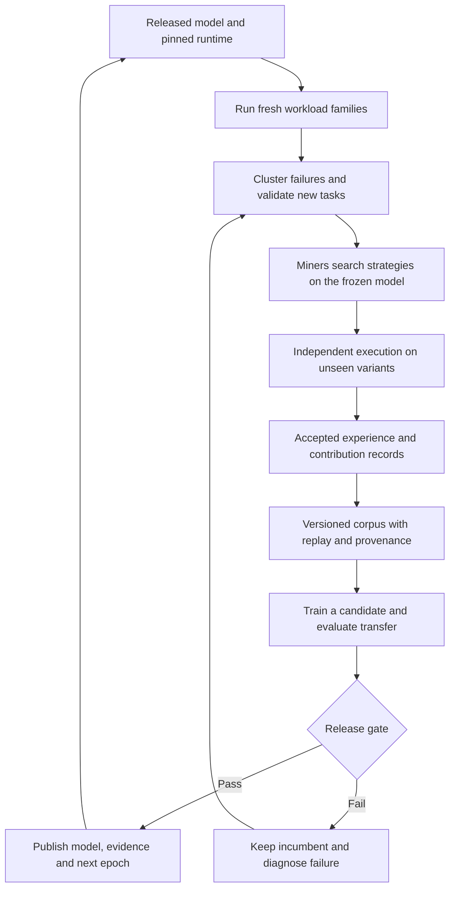

**Spark Hermes: engineering, open competition, and continuous improvement**

Reviewed 2026-09-11 against the working tree based on commit `5d7f712bcaedca93815c5f62d2e818b027b5bb3a`, including uncommitted operator-pipeline changes. External sources were checked on the same date. This is a design and implementation review, with CPU reproductions; it is not evidence of live subnet payouts or model improvement. Recommendations below are proposed work, not implemented functionality.

**Assessment**

The strongest idea is to pay a diverse population to discover better behavior from the same model, independently execute that behavior, and turn transferable successes into the next model's training data. That makes the durable product a verified learning process and its accumulated experience.

Three different accomplishments must be measured separately:

1. A miner improves a frozen model through a prompt or skill.
2. Training transfers that improvement into a model under the intended deployment context.
3. The updated model improves on unseen task families over successive releases.

The first does not establish the second or third. The CPU operator workflow has been exercised, but the live competition and the recurring learning process have material gaps. My earlier software-completion assessment should be read as completion of the tested operator workflow, not certification of the whole competitive system. Passing 2,657 tests did not establish the cross-module invariants identified here.

**What the engineering already gets right**

The repository contains substantial foundations: pinned model/template artifacts, real tool execution, public and withheld verifiers, private submission storage, commitment and round lifecycle primitives, repeated-run statistics, executed-trajectory collection, SFT/DPO preparation, artifact hashes, evaluation exports, and a promotion gate. The offline self-check and wheel/container checks make the operator path much easier to maintain. See [project status](project-status.md).

Task generation also tests its own tasks: untouched workspaces must fail, reference solutions must pass, and a deliberately overfit solution must distinguish the public verifier from the withheld one. These checks in [the generation gate](../hermes/taskgen/gate.py) are valuable defenses against training on broken tasks. They establish specific behavioral tests, not completeness of the specification or independence of a generator from its own verifier.

The aggregate collector reads all settled miners' episodes, rather than only the crown holder's. Preserve that: a losing entry can contain a useful, distinct solution. Correctness should determine training eligibility; winning the tournament should not be the only route into the learning corpus. See [aggregation](../validator/aggregate.py).

**Confirmed engineering gaps affecting competition**

CPU probes used deterministic, synthetic records; no model or GPU was involved. Their outputs are saved in [review evidence](pipeline-research-evidence.json). Static findings below identify their source separately.

| Priority | Finding and evidence | Consequence and required change |
|---|---|---|
| P0 | `validator.score.candidate_arm` uses `hidden_passed is not False`. A probe with missing hidden results was accepted. Separate probes with failed integrity, malformed protocol, or the wrong task ID were also accepted by `score`. | Use one strict evidence validator for payout and training: expected task/epoch, actual execution identity, boolean public/private passes, integrity, protocol, budgets, and complete measured attempts. The stricter `admin` corpus path does not repair the competition path. [Scorer](../validator/score.py) |
| P0 | `judge_one` checks the committed digest, but `runner_for` resolves its path again through `_bundle_for`, which selects the first receipt for the miner/round. A two-upload probe selected the first bundle even when the intended commitment was the second. | Pass the already-validated immutable bundle path and digest into execution; do not resolve by identity a second time. Test upload A, upload B, commit B, execute B. [Judge](../validator/judge.py) |
| P0 | The hourly workflow checks out a fresh hosted runner but does not retrieve private `var/scorecards` or the round store. Crown state is written only to `/tmp`. It invokes `select` and then `actions` against the updated state; a probe shows the initial label-add disappears on that second calculation. | Run a durable controller beside the authoritative store. Compute a transition and its actions once, persist both, apply actions with retry, and acknowledge completion. The existing job is not an operational hourly tournament. [Workflow](../.github/workflows/crown.yml), [crown state](../validator/crown.py) |
| P0 | `contenders_from` reads every graded/settled scorecard in the directory without filtering to a current round or epoch, and does not gate on the recorded acceptance decision. | Scope candidates and incumbents to explicit epoch/round IDs and require a validated acceptance record. Old results must not automatically compete forever. [Crown collection](../validator/crown.py) |
| P0 | `miner.evaluate.runner_argv`, used by the judge, selects the packaged `all` suite and has no generated-task-root handoff. The operator path protects those same packaged tasks as evaluation-only. | Separate training competitions from release evaluation. Pass a registered competition task root and family split through the judge; add an explicit settled-round-to-training import with provenance checks. [Runner arguments](../miner/evaluate.py), [split](../admin/split.py), [operator training](../admin/training.py) |
| P1 | A synthetic 0/10 to 10/10 improvement costing 120 instead of 100 tokens is refused. Conversely, a 5% token saving fails the acceptance gate but wins `crown.select`. | Define one versioned reward policy with separate capability and efficiency decisions; share it across scorecards, crown selection, and settlement. [Acceptance](../hermes/acceptance.py), [crown](../validator/crown.py) |
| P1 | Model promotion always requires a significant success-rate increase; equal-success, cheaper models cannot pass. | Decide explicitly whether efficiency-only releases are a product goal. If so, add a separately validated non-inferiority-plus-cost-improvement route. Do not simply remove the success guard. [Promotion](../hermes/promotion.py) |
| P1 | SFT preserves the submitted system prompt. Preference pairs can span miners with different prompts, while DPO preparation requires an identical initial prompt. | Define whether the released artifact includes a strategy, or whether its behavior must be distilled into weights. Match preference contexts and test transfer without the winning prompt. [Aggregation](../validator/aggregate.py), [DPO rendering](../admin/training.py) |
| P1 | The documented contract permits reference files, but the runner rejects them and eagerly loads skill text. | Align the published optimization surface with the executable one. Measure lazy skill/reference loading only after implementing and pinning it. [Profile composition](../hermes/profile.py) |

Two further deployment boundaries need explicit contracts. The upload route accepts a caller-supplied `miner_id`; the route itself does not establish a signed Bittensor identity. An external gateway may provide authentication, but that was not established here. Also, receipts are rewritten without a transactional store. Open intake needs authenticated ownership, admission limits, and concurrent-write/crash tests. See [API](../validator/api.py) and [intake](../validator/intake.py).

**What “open competition on Bittensor” currently means**

Bittensor provides a mechanism for aggregating validators' miner evaluations and distributing incentives. It does not independently establish that a verifier measures useful work, that a dataset generalizes, or that training improves the model. Those remain responsibilities of the subnet's evaluation design. [Bittensor Yuma documentation](https://www.bittensor.com/docs/internals/consensus).

The reward connection must be verified before promising miners payouts. Current Gittensor documentation describes merged PRs as earning score, open PRs as potentially carrying collateral, and closed PRs as affecting credibility. Spark Hermes's crown design keeps a winner open and closes challengers. These mechanisms do not align automatically. [Gittensor OSS scoring](https://docs.gittensor.io/oss-contributions.html).

The public `master_repositories.json` inspected for this review contains `gittensor-ai-lab/sparkinfer`, not this checkout's origin, `gittensor-model-hub/Spark-Hermes`; its listed reward labels are `eval:*`, not `crown`. This establishes a gap in the public configuration examined, not proof about every deployed validator's configuration or historical payouts. A label in this repository is not evidence of an on-chain reward. [Public registry inspected](https://raw.githubusercontent.com/entrius/gittensor/main/gittensor/validator/weights/master_repositories.json).

Choose an explicit settlement contract: either merged, immutable contribution records scored by Gittensor's registered repository rules, or a dedicated, approved competition score adapter. For either approach, demonstrate the chain from signed miner identity to accepted artifact, settlement record, validator score, and observed reward. Repository-specific eligibility and label settings must be checked, not assumed. [Gittensor repository configuration](https://docs.gittensor.io/repository-hyperparameters).

Open participation should mean published rules, equal access to the runnable baseline, a reproducible local development harness, bounded evaluation access, a documented dispute process, and attribution that survives later distillation. GPU ownership need not be the admission requirement for a prompt/skill competition: provide a controlled development endpoint, separate from the final hidden grader. Identical models alone do not equalize search budgets.

Keep the official model, tools, budgets, and runtime fixed within an epoch. Permit broad offline research by miners, including their own optimizers or teachers; official credit depends on what the pinned runtime can reproduce from an allowed submission. Changes to verifiers, harness code, task generators, and deployment infrastructure belong in a separately reviewed contribution track. A miner should never change the rules used to score their own current submission.

Permanent secrecy and fully public reproduction cannot both describe the same strategy artifact. There is also an existing disclosure path: the runner records the composed system prompt in trajectories, and `validator.audit.build` copies episode logs into audit bundles. With trajectory logging enabled, publishing such a bundle can expose the supposedly private strategy. Define an explicit embargo/release policy, publish a redacted public audit where appropriate, and document what may be retained for training. Redaction preserves less public replay evidence; acknowledge that tradeoff. [Runner](../hermesbench/runner.py), [audit export](../validator/audit.py).

**How the system should improve continuously**

Use two cadences: frequent strategy evaluation within a frozen model epoch, and less frequent model releases when sufficient diverse evidence and training data exist. An hourly competition need not cause hourly training. A failed candidate leaves the incumbent unchanged; continuous experimentation does not require continually replacing the model.

The missing central component is a durable cycle controller. Existing commands provide useful stages, but no inspected path coordinates the full sequence from workload discovery through settlement, corpus admission, training, promotion, and next-epoch activation. The nightly benchmark workflow checks suite integrity; it does not train a model. The hourly crown job does not create and execute the next round.

A cycle record should bind the parent model, harness, task-family split, generator/verifier versions, submission digests, execution artifacts, dataset digest, trainer settings, candidate model, evaluation reports, settlement record, and release decision. Every transition needs a stable job identity, explicit success/failure state, and restart behavior. External effects such as labels, rewards, and publishing should consume persisted action records, so a retry cannot pay twice or skip an operation.

For successive training cycles, choose a documented policy: warm-start from the accepted model, or retrain from the original base using accumulated experience. Both can be legitimate experiments. The current operator's SFT preparation starts from its configured base pin; it does not automatically turn the last promoted model into the next parent. An epoch transition must update the actual model/runtime contract and invalidate comparisons against obsolete baselines.

Task supply must respond to measured weaknesses. Cluster failures by underlying skill—recovery, navigation, state tracking, verification, long-horizon consistency—rather than by filename alone. Build families with changed repositories, inputs, constants, and error order. Select tasks using usefulness, coverage gaps, baseline difficulty, verifier strength, and recent learning progress. A round-robin rotation after two empty rounds is not an adaptive curriculum.

Separate three data uses: public development tasks, private competition variants, and sealed release evaluation. Split by repository/task family and time where appropriate. The existing 19 tasks are useful regression fixtures; ten attempts each still represent 19 distinct tasks, not 190 independent demonstrations of generality. Exact IDs and shared-text checks do not detect semantic or repository-family leakage.

Retire exposed competition variants. Settling a round reveals its per-task salt, which weakens secrecy for short, guessable checks; publishing full checks ends it outright. Reusing the same task and commitment in later rounds cannot be treated as a fresh hidden test. Keep a fixed regression suite, but refresh the sealed release pool with controlled feedback and a record of what has already been queried.

Reward useful marginal contributions. First assess a reliable capability gain within a declared resource ceiling; then assess cheaper solutions at comparable correctness. Do not require a newly solvable task to be cheaper than an unsuccessful early exit. For efficiency, record uncached input, cached input, output, tool compute, and controlled-hardware latency separately. Raw tokens remain useful measurements but are not a universal monetary or compute exchange rate.

A single crown can remain a public recognition mechanism, while contribution credit reflects reproducible progress, coverage, and verified task/verifier improvements. Compare this design experimentally with winner-take-all rather than assuming either maximizes learning. Avoid indefinite incumbent credit across changed tasks or epochs. Preserve useful non-winning trajectories, limit duplicate credit, and measure whether newcomers can contribute at a bounded search budget.

**The research case—and its limits**

| Research | Relevant lesson | What Spark Hermes still has to establish |
|---|---|---|
| [GEPA, revised February 2026](https://arxiv.org/abs/2507.19457) | Reflecting on execution traces and evolving prompts can improve behavior with a fixed model; combining complementary candidates is useful. | Whether paid, diverse miner search beats a public prompt optimizer under comparable total search/evaluation budgets. |
| [STaR](https://arxiv.org/abs/2203.14465) | Iterative generation, correctness selection, and fine-tuning can improve reasoning. | Whether successful agent trajectories transfer across repositories and task families, and remain useful after later cycles. |
| [Evolutionary System Prompt Learning, February 2026](https://arxiv.org/abs/2602.14697) | Joint prompt evolution and weight learning is a researched approach, with reported benefits in the paper's settings. | Whether the same synergy holds for this runtime, miner population, verifiers, and SFT/DPO objectives. The paper does not validate this implementation. |
| [POET](https://arxiv.org/abs/1901.01753) | Generating diverse environments alongside solutions and transferring discoveries can create a curriculum. | Whether generated tasks remain representative of useful agent work rather than merely becoming harder or more numerous. |
| [DPO](https://arxiv.org/abs/2305.18290) | Preference learning can optimize a policy relative to a reference without a separate learned reward model. | Whether current whole-trajectory comparisons give the desired signal: tool observations are external outcomes, and different miner system prompts are different conditioning contexts. |
| [The Ladder](https://arxiv.org/abs/1502.04585) | Repeated adaptive submissions can overfit a holdout through leaderboard feedback. | A competition-wide evaluation/feedback policy, fresh confirmation tasks, and protection against selecting noisy winners. Ordinary per-submission intervals are insufficient. |
| [Accumulating real and synthetic data](https://arxiv.org/abs/2404.01413) | In the studied settings, retaining original data alongside successive generated data avoids collapse observed when data are replaced. | A replay mixture that preserves breadth here. This supports testing accumulation; it does not guarantee that filtered synthetic agent traces cannot regress. |
| [RLPR](https://arxiv.org/abs/2506.18254) | Reference-answer probabilities can supply a training signal outside domains with executable verifiers. | Calibration, aligned teacher-forced probabilities, and resistance to reward exploitation. `hermes/reward_pr.py` currently provides numerical helpers, not an integrated training or serving loop. |

RLPR's reproducible score is still a proxy for quality. A miner could improve that proxy without improving task execution. Keep it an explicitly experimental learning signal until independently validated; do not silently substitute it for executable correctness in payouts or release decisions.

For DPO, preserve the full context that produced an action. Do not fix differing miner prompts by deleting them and assuming the examples remain equivalent. Start with preference pairs generated under the same context, or explicitly implement and test a distillation objective that accounts for the difference. Compare assistant-action masking against the current objective, which also scores tool-result tokens. SFT-only is a necessary control, not an inferior default.

**The decisive experiments**

The key hypothesis is: *miner discoveries can be converted into reusable model capability at acceptable cost, without losing existing capability.* Measure that with a simple factorial comparison on unseen families:

| Model | Canonical deployment context | Winning strategy context |
|---|---|---|
| Current model | A: baseline capability | B: strategy contribution |
| Trained candidate | C: transferred model capability | D: combined model and strategy |

`B > A` demonstrates useful search. `C > A` demonstrates transfer under the intended canonical context. `D > B` tests whether training adds value beyond retaining the strategy. Repeat these comparisons over several cycles with a preserved regression set and fresh sealed families. Changing model, prompt, runtime, and test suite simultaneously makes attribution impossible.

Also compare miner search with random/best-of-budget search and a GEPA-style baseline; compare SFT with SFT+DPO; and compare recent-only data with accumulated replay. Match and report total training and search budgets. Do not attribute extra inference-time search to better weights.

Report success and cost at the family level with uncertainty, retention on older capabilities, malformed/integrity failure rates, and performance on fresh workloads. A deterministic CPU calculation illustrates why ten successes are not enough to advertise near-perfect reliability: 10/10 has a Wilson 95% lower bound of approximately 72.2%; a strategy with true 90% success still gets 10/10 about 34.9% of the time. Likewise, 100 independent tests each with a true 5% false-positive rate have a 99.4% chance of at least one false positive. These are illustrations, not measured rates of the actual bootstrap gate. Predeclare selection and confirmation procedures and account for repeated testing.

Track the process itself: accepted distinct families per evaluation budget, marginal value of miner search over the optimizer baseline, usable training yield, transfer gain, regression rate, failed-cycle causes, validator disagreement, reward concentration, and contributor retention. Dataset size, merged-PR count, crown changes, and model-version count alone do not establish learning.

**Recommended order of work**

| Order | Deliverable | Evidence needed to call it complete |
|---|---|---|
| 1 | One authoritative evidence and reward contract | CPU adversarial tests reject missing/incorrect evidence; committed bundle equals executed bundle; scorecard/crown/settlement agree. |
| 2 | Durable competition controller and payout integration | Restart a full synthetic round mid-transition; recover without lost submissions, stale rankings, duplicate actions, or duplicate credit. Separately verify the configured external reward path. |
| 3 | Family-based task registry and feedback policy | Generated competition tasks flow through judging and corpus admission; sealed release families cannot enter training; spent variants are retired. |
| 4 | Provenance-preserving miner-to-training handoff | Accepted multi-miner experience yields valid training inputs, including an explicit policy for private prompts, preference contexts, and attribution. |
| 5 | Controlled transfer experiment | Measure A/B/C/D and budget-matched search/training baselines when model execution is authorized. |
| 6 | Repeated release cycles | Several independently evaluated cycles show useful gains with retention, or failures produce a diagnosed and improved task/training policy while keeping the incumbent. |

The defensible ambition is an open market for verified discoveries that compound into better agent capability. Establishing that requires aligned rewards, trustworthy evidence, diverse task supply, and measured transfer—not merely a functioning trainer or a frequently updated leaderboard.
