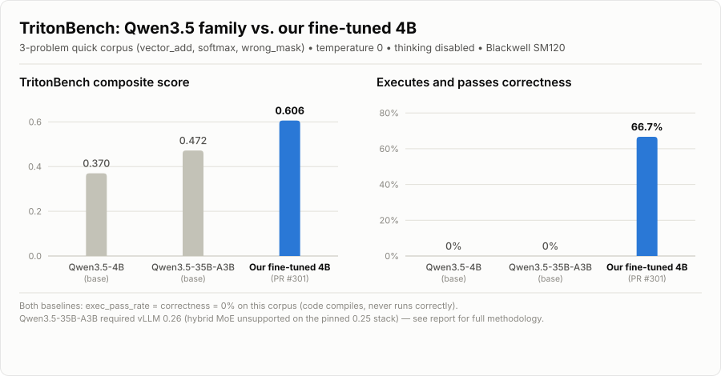

# TritonBench: Qwen3.5 base models vs. our fine-tuned 4B

> Numbered PR and issue references below are historical and point at the pre-rename
> repository, which is now a private archive (`Spark-Hermes-3.8-27B`). They are kept as
> plain text rather than links: the public repository's numbering is unrelated, so
> linking them would produce citations that resolve to the wrong thing.

**Audience:** anyone asking whether SparkDistill's training-track fine-tuning is worth it against just running a bigger stock model.
**Scope:** an ad-hoc, non-training-track TritonBench comparison of two off-the-shelf Qwen3.5 checkpoints against our fine-tuned 4B recipe already recorded on `main` (PR #301).
**Date:** 2026-07-29.

---

## TL;DR



Our fine-tuned 4B — **~9x smaller** than the 35B-A3B MoE — is the only one of the three whose generated Triton kernels actually **execute and pass correctness** on this corpus (2 of 3 problems). Both stock base models produce plausible-looking Triton that mostly compiles but **never runs successfully** (0% exec_pass_rate, both models, all 3 problems).

| Model | Composite | Exec pass | Correctness | Syntax pass |
|---|---|---|---|---|
| Qwen3.5-4B (base) | 0.370 | 0% | 0% | 100% |
| Qwen3.5-35B-A3B (base) | 0.472 | 0% | 0% | 66.7% |
| **Our fine-tuned 4B** (PR #301) | **0.606** | **66.7%** | **66.7%** | 100% |

## What we tested

- **Corpus:** TritonBench "quick" config — 3 problems total: `level1/vector_add`, `level1/softmax`, `bugfix/wrong_mask`. This is the *entire* pinned corpus today — levels 2–4 have no problems populated (a known, pre-existing harness limitation, see `docs/research-summary.md` §8), so a "full" run and this "quick" run score identically.
- **Config:** `tritonbench/configs/eval_quick.yaml` — temperature 0, max_tokens 3072.
- **Hardware:** a single NVIDIA RTX PRO 6000 Blackwell Server Edition (SM120), driver 595.71.05 — the same architecture as the frontier run these numbers compare against.
- **Our fine-tuned 4B:** *not re-run here.* These are the scores already verified and recorded for PR #301 (`Qwen/Qwen3.5-4B` LoRA fine-tune, `recipes/qwen3.5-4b-phase1/sft-mining-bf-v1.yaml`, `sequence_len` 8192, 3 epochs) — see `runs/frontiers.json` and `runs/2026-07-28-qwen3.5-4b-blackwell-seq8192-v1/`.
- **Qwen3.5-4B (base):** stock `Qwen/Qwen3.5-4B` off Hugging Face, no fine-tuning.
- **Qwen3.5-35B-A3B (base):** stock `Qwen/Qwen3.5-35B-A3B` off Hugging Face (35B total params, ~3B active/token; hybrid Gated-DeltaNet + MoE attention). Note: there is no "A4B" variant of this model — the released 35B MoE is **A3B**.

## How each model was served

| Model | vLLM | Flags | Notes |
|---|---|---|---|
| Our fine-tuned 4B | — | — | recorded from the existing attested proof-bundle verification, not re-served |
| Qwen3.5-4B (base) | **0.25.0** (pinned reward-eligible stack, `scripts/install_serve.sh`) | `--dtype bfloat16 --max-model-len 8192 --compilation-config '{"cudagraph_mode": "NONE"}'` | matches the frontier run's serve profile |
| Qwen3.5-35B-A3B (base) | **0.26.0** (separate venv — see Deviation 1) | `--dtype bfloat16 --max-model-len 8192 --max-num-seqs 64` (see Deviation 2) | |

All requests went through `tritonbench.cli eval` with `chat_template_kwargs: {"enable_thinking": false}` patched locally into `tritonbench/harness/model_interface.py` (see Deviation 3) — not committed to the repo.

## Deviations from the pinned/stock path (read before trusting this for more than a rough comparison)

1. **vLLM version mismatch for the 35B.** The pinned `vllm==0.25.0` — the version the training-track gate's serve stack installs — **hangs indefinitely** initializing KV cache for `Qwen3.5-35B-A3B`'s hybrid Gated-DeltaNet/MoE architecture. Reproduced twice, identically, with and without `--enforce-eager`. Qwen's own model card states vLLM's *main branch* is required for the Qwen3.5 family. We installed vLLM 0.26.0 in a separate venv to serve it at all. The base 4B and our fine-tuned 4B are both on the pinned 0.25.0 stack; **the 35B row is on different tooling than the other two.**
2. **`--max-num-seqs 64` for the 35B.** The default (1024) exceeds the model's available Mamba/GDN cache blocks (822) and vLLM 0.26 refuses to start without a lower cap. This only bounds concurrency, not correctness, but is a launch-config deviation from a stock invocation.
3. **Thinking disabled** (`enable_thinking: false`) for both base models. Without it, the 35B's chain-of-thought exceeded the harness's per-request timeout before emitting a kernel at all (confirmed via a raw endpoint reproduction before patching this). This makes the comparison fairer to our non-thinking fine-tuned specialist, but `tritonbench/harness/model_interface.py` does not set this key by default — it is not the harness's stock request shape.
4. **Harness request timeout raised 300s → 900s locally**, since the base 4B decoded much slower than the 35B (see gen times below — it ran with `cudagraph_mode: NONE` to match the frontier serve profile, vs. the 35B's default cudagraph). Not committed.
5. **This is not a training-track submission.** No `eval.verify` / `eval.training_track_gate` attestation ran for the two base-model rows — no GPU attestation, no `claim_sha256` binding, nothing gated through CI. Treat these two rows as an informal, reproducible-by-command measurement, not a verified claim.
6. **n = 3 problems.** The entire corpus is 3 kernels — one problem flipping is ~33 points of exec_pass_rate. Not a statistically robust sample; see `docs/research-summary.md` §8 ("Is TritonBench a fair judge?").

None of these deviations touch the recorded PR #301 numbers, which are exactly what's on `main` today in `runs/frontiers.json`, verified through the normal attested pipeline.

## Full results

### Composite and sub-metrics

| metric | Qwen3.5-4B (base) | Qwen3.5-35B-A3B (base) | Our fine-tuned 4B (PR #301) |
|---|---|---|---|
| composite | 0.370 | 0.472 | **0.606** |
| exec_pass_rate | 0.0% | 0.0% | **66.7%** |
| correctness | 0.0% | 0.0% | **66.7%** |
| syntax_pass_rate | 100% | 66.7% | 100% |
| api_modernity | 0.567 | 0.583 | not published¹ |
| perf_awareness | 0.222 | 0.556 | not published¹ |
| avg gen time / problem | 135.5s | 30.9s | not published¹ |

¹ Our fine-tuned 4B's numbers come from PR #301's attested proof bundle (`eval_scores.json`), which carries only the headline aggregate scores (`triton`, `triton_exec_pass_rate`, `triton_correctness`, `triton_syntax_pass_rate`) — TritonBench's fuller per-metric/per-problem breakdown isn't part of what gets attested and committed.

### Per-problem detail

#### Qwen3.5-4B (base)

| problem | syntax_ok | exec_pass | failure | gen_time_s |
|---|---|---|---|---|
| softmax (L1) | ✅ | ❌ | `CompilationError: make_tensor_descriptor() missing 2 required positional arguments` | 205.8 |
| vector_add (L1) | ✅ | ❌ | `AttributeError: 'function' object has no attribute 'arg_names'` | 103.3 |
| wrong_mask (bugfix) | ✅ | ❌ | `TypeError: got an unexpected keyword argument 'mask'` | 97.5 |

#### Qwen3.5-35B-A3B (base)

| problem | syntax_ok | exec_pass | failure | gen_time_s |
|---|---|---|---|---|
| softmax (L1) | ✅ | ❌ | `ValueError: Conflicting meta-parameters: BLOCK_SIZE` | 36.4 |
| vector_add (L1) | ❌ | ❌ | emitted a prose sentence before the code fence; the harness's extraction saw a `SyntaxError` | 30.1 |
| wrong_mask (bugfix) | ✅ | ❌ | `ValueError: Conflicting meta-parameters: BLOCK_SIZE` | 26.1 |

Both base models fail on **different** root causes across all three problems — stale/hallucinated Triton APIs (`make_tensor_descriptor`, `tl.max(..., mask=...)`, re-defining an auto-tuned `BLOCK_SIZE`), not one shared bug. That reads as "knows Triton syntax in general, hasn't specialized on this exact API surface" — precisely the gap the mining recipe targets.

## Interpretation

- Scale alone helped the base 35B's composite (+27.6% over the base 4B), mostly through better `perf_awareness` and slightly better `api_modernity` — not through actually running kernels. Both stock models sit at 0% exec_pass_rate / 0% correctness on this corpus.
- Our fine-tuned 4B (trained from the same 4B base) beats the 35B-A3B composite by +28.4% and, more importantly, is the only checkpoint of the three whose kernels run and check out numerically correct (2 of 3). It is roughly **9x smaller** than the 35B-A3B (dense 4B vs. 35B total / ~3B active MoE).
- Net read: targeted SFT on the pinned mining corpus (`sparkproof-mining`, 1154 rows) buys more executable-Triton competence on this benchmark than an order of magnitude more base-model parameters.

## Reproduction

```bash
# base 4B, pinned stack (matches the reward-eligible serve path)
bash scripts/install_serve.sh
PATH="$HOME/.sparkdistill-serve/bin:$PATH" vllm serve Qwen/Qwen3.5-4B \
  --served-model-name model --port 8000 --seed 0 --no-enable-prefix-caching \
  --dtype bfloat16 --max-model-len 8192 --compilation-config '{"cudagraph_mode": "NONE"}'

# 35B-A3B needs a newer vLLM (see Deviations 1-2)
uv venv ~/.vllm-latest --python 3.12 --python-preference only-managed
UV_INDEX_STRATEGY=unsafe-best-match VIRTUAL_ENV=~/.vllm-latest uv pip install vllm ninja
~/.vllm-latest/bin/vllm serve Qwen/Qwen3.5-35B-A3B \
  --served-model-name model --port 8000 --seed 0 --no-enable-prefix-caching \
  --dtype bfloat16 --max-model-len 8192 --max-num-seqs 64

# then, per model (thinking-disable patch + timeout bump applied locally — see Deviations 3-4):
cd tritonbench
TRITONBENCH_BLACKWELL_PROFILE=workstation .venv/bin/python -m tritonbench.cli eval \
  --config configs/eval_quick.yaml --endpoint http://127.0.0.1:8000/v1 --model model \
  --levels 1 --output /path/to/results
```

Nothing from this comparison is written to `runs/` — that directory is reserved for attested training-track ledger entries. This document is the only artifact from the exercise.

## Related work landed this session

- #305 — training-track auto-merge `contents: write` fix
- #307 — attestation freshness guard
- #315 — fixed the two `eval.triton_bench` / pinned-vLLM startup bugs this comparison's base-4B row exercises (#303)
- #316 — ledger recording for auto-merged PRs
